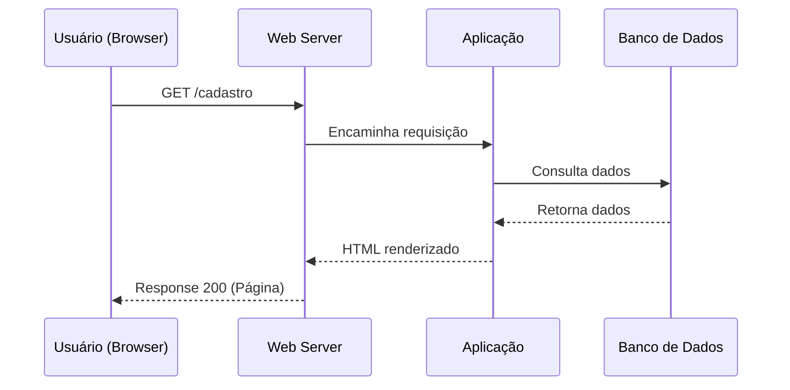

# Diagrama de sequência

Um diagrama de sequência consiste em um grupo de objetos representados por linhas de vida e as mensagens que eles trocam durante a interação. Um diagrama de seqüência mostra a seqüência de mensagens transmitidas entre objetos. Diagramas de seqüência também mostram as estruturas de controle entre objetos.

## Exemplo do Diagrama no GITHUB

Este fluxo descreve o acesso à página `/cadastro` via requisição HTTP GET.

Você pode validar on-line em: [mermaid.live](https://mermaid.live/)

## Algumas ferramentas

Alguns sites disponibilizam a criação dos Diagramas

- [Ferramentas](./docs/tools.md)

## Conclusão

Existem muitas ferramentas para criar diagramas de sequência, e a escolha da ferramenta depende do seu orçamento, preferências de interface, necessidade de colaboração e complexidade do projeto. Se você precisa de algo simples e gratuito, o **Draw.io** ou **PlantUML** são excelentes opções. Se você preferir uma solução mais robusta, pode optar por ferramentas como **Lucidchart**, **StarUML** ou **Microsoft Visio**, que oferecem mais funcionalidades e suporte corporativo.

Se você está criando diagramas com frequência e precisa de colaboração em tempo real, **Lucidchart** e **Creately** são ideais. Para desenvolvedores que preferem um fluxo de trabalho mais baseado em código, **PlantUML** é uma excelente escolha.