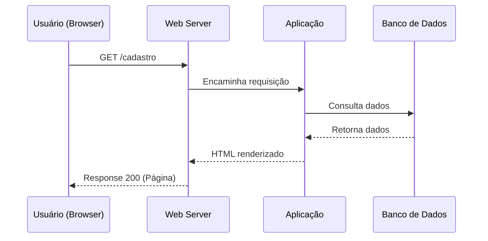
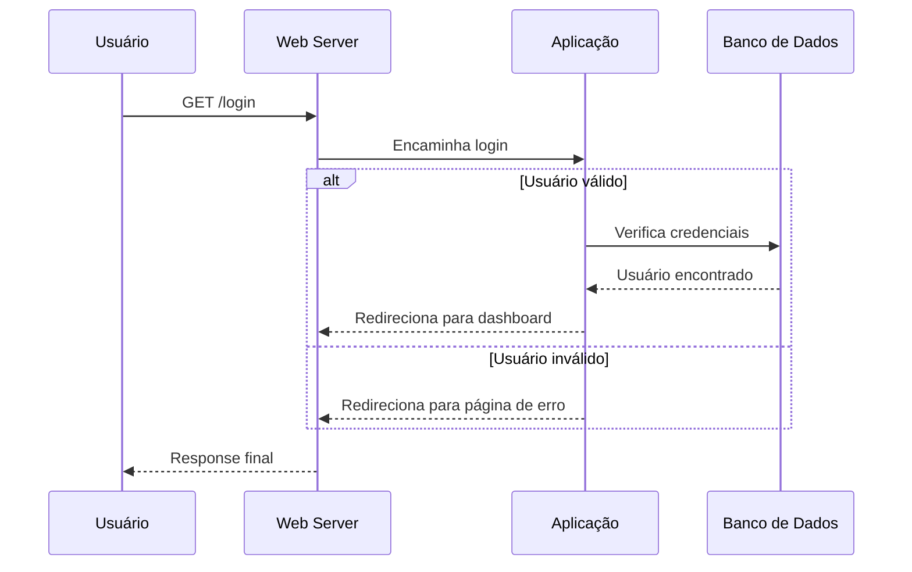
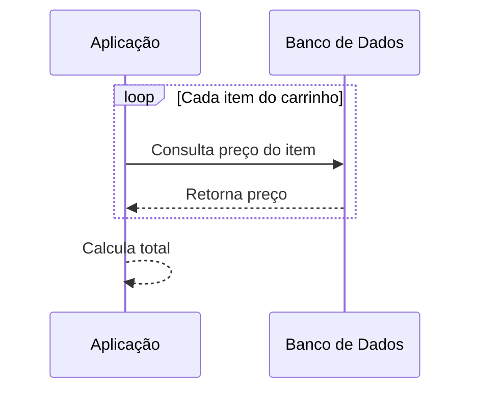
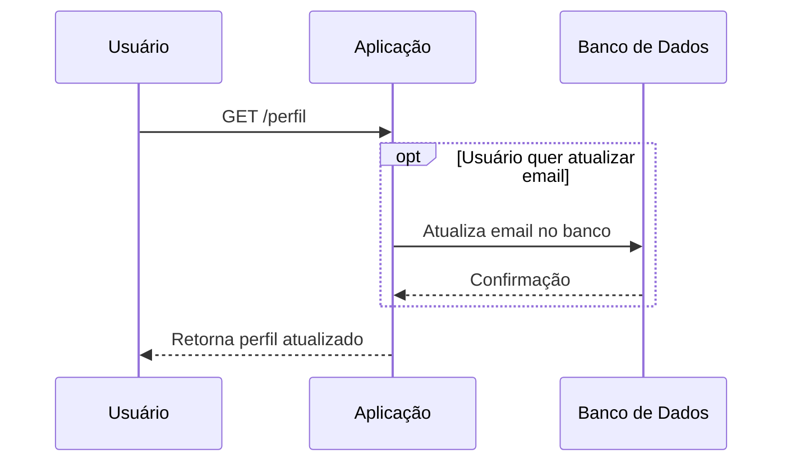

# Diagramas de Sequência

Um **diagrama de sequência** representa a interação entre objetos em um sistema ao longo do tempo. Ele mostra:

* **Linhas de vida** de cada objeto ou participante.
* **Mensagens** trocadas entre os objetos.
* **Estruturas de controle**, como alternativas, repetições e ações opcionais.

Esses diagramas são especialmente úteis para **documentar fluxos de sistema** e **visualizar processos complexos**.

---

## Exemplo básico

O diagrama abaixo descreve o fluxo de acesso à página `/cadastro` via uma requisição HTTP GET:

---

## Estruturas de controle

### 1️⃣ `alt` — Alternativas / if–else

Mostra **cenários diferentes** dependendo de condições:

💡 **Explicação:**
`alt` define **cenários alternativos** (como `if-else`). Cada bloco começa com `alt` ou `else` e termina com `end`.

---

### 2️⃣ `loop` — Repetições

Indica **ações repetitivas**, como processar múltiplos itens:

💡 **Explicação:**
Use `loop` sempre que um mesmo processo precisa ocorrer várias vezes.

---

### 3️⃣ `opt` — Ações opcionais

Representa **operações que podem ou não ocorrer** dependendo de uma condição:

💡 **Explicação:**
`opt` é ideal para **opcionalidade**, como atualização de dados ou notificações extras.

---

## Validação online

Você pode testar e visualizar seus diagramas online em: [Mermaid Live Editor](https://mermaid.live/)

---

## Ferramentas úteis

Alguns sites e extensões ajudam na criação de diagramas Mermaid:

* [Ferramentas](./docs/tools.md)

No VS Code, extensões como **Markdown Preview Mermaid Support** ou **Mermaid Editor** permitem renderizar diagramas diretamente no editor.

---

## Conclusão

Diagramas de sequência são essenciais para **documentar fluxos de aplicação**, **facilitar o entendimento de processos complexos** e **ajudar equipes a visualizar interações entre sistemas**.

Usando `alt`, `loop` e `opt`, é possível representar **condições, repetições e ações opcionais**, tornando o diagrama **mais próximo da realidade do sistema**.

---
